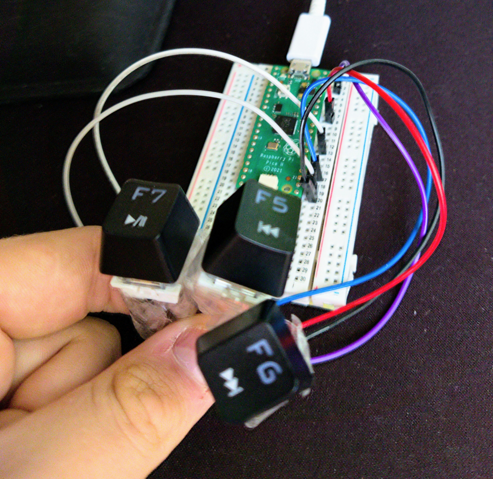

 

  <h3 align="center">HID Music controller for RP2040 Boards</h3>

  

    Music controller based on CircuitPython, Adafruit libraries and full-sized Raspberry Pi Pico board
     
     
    <a href="https://github.com/kriptide/rp2040-music-controller">View Demo</a>
    .
    <a href="https://github.com/kriptide/rp2040-music-controller/issues">Report Bug</a>
    .
    <a href="https://github.com/kriptide/rp2040-music-controller/issues">Request Feature</a>
  

    

## Table Of Contents

* [About the Project](#about-the-project)
* [Built With](#built-with)
* [Getting Started](#getting-started)
  * [Prerequisites](#prerequisites)
  * [Installation](#installation)
* [Usage](#usage)
* [Contributing](#contributing)
* [License](#license)
* [Authors](#authors)
* [Acknowledgements](#acknowledgements)

## About The Project

Maybe there are more projects (and maybe better ones) that can do that, but I've made it for fun actually.

This project is shipped with libs from AdaFruit and with CircuitPython firmware.
* Fits perfectly into Stock 2MB Raspberry Pi Pico board,
* Works plug-and-play,
* You can use other buttons - I've used mechanical outemu switches, because they are useless for me. :smile:

## Built With

* [Raspberry Pi Pico OEM Board](https://www.raspberrypi.com/products/raspberry-pi-pico/)
* [3x Mechanical OUTEMU Switches](https://a.allegroimg.com/s1024/0c65fd/5c4c937d454fa84f196954cd7f7f)
* Breadboard
* 6x jumper wires (Female -> Male)

Coded with:
* python3
* CircuitPython firmware
* AdaFruit Libraries
* Thonny

## Getting Started

This is a complete setup to configure your RP2040 board, install Libraries and launch the code.

### Prerequisites

We need:
* [Python](https://www.python.org/downloads/)
* [Thonny IDE](https://thonny.org/)
* [CircuitPython Firmware (You need to select one for your board)](https://circuitpython.org/downloads)
* AdaFruit Libraries (can be installed in Thonny)

### Installation

1. Install the newest python version from official website: [Here](https://www.python.org/downloads/)
2. Install Thonny IDE to read/write RP2040 board stuff: [Here](https://thonny.org/)
3. Before plugging RP2040 board to the computer, while disabled - hold *BOOT* or *BOOTSEL* button then plug the RP2040 board to the computer (RP2040 board should be visible as a detachable drive with 128MB capacity)
4. Download CircuitPython firmware for your board: [Here](https://circuitpython.org/downloads)
5. Move the downloaded firmware (.uf2 file) into the board's directory - then it should restart itself and be ready to work.
6. Launch Thonny, in the right-bottom corner, change the *Local Python3* to *CircuitPython (RP2040)*
7. In Thonny, on the top, select Tools, then Manage packages
8. Install AdaFruit packages by searching names: **Adafruit_Blinka**, **Adafruit_PlatformDetect**, **Adafruit_PureIO**, **adafruit_circuitpython_busdevice**, **adafruit_circuitpython_hid**, **adafruit_circuitpython_requests**, **adafruit_circuitpython_typing**, **pyftdi**, **pyserial** and **typing_extensions**
9. Then in Thonny, rename main script file to *code.py* to make the script launch automatically whilst connecting RP2040 board to any device using USB interface
10. Copy the repository's code.py contents into *your device's code.py file*

## Usage

This script was intended to use with 4 GPIOs-connected mechanical switches [(The entire stock Pi Pico board datasheet is available here.)](https://www.raspberrypi.com/documentation/microcontrollers/raspberry-pi-pico.html)

The Outemu switch uses 2 pins: the function pin (on the right), and ground (on the left). You can use the **Female to Male jumper wires** to connect the switches to the breadboard (like these under this text).

**In the code(.)py script file**, the **stop** button is aligned to the GPIO19,
the **play/pause** button is aligned to the GPIO17, 
the **previous track** button is aligned to the GPIO18 and the **next track** button is aligned to the GPIO16, so:
* you connect the right side of the mechanical switch to female wire side, then the second wire side to the breadboard (according to the [datasheet of the Raspberry Pi Pico board](https://www.raspberrypi.com/documentation/microcontrollers/raspberry-pi-pico.html))
* you connect the left side of the mechanical switch to female wire side, then to the any **GND** pin on the RP2040 board.

**Repeat it to all of the switches (Prev | Next | Play/Pause | Stop) you want to use.**
It all should like that:

## Contributing

Contributions are what make the open source community such an amazing place to be learn, inspire, and create. Any contributions you make are **greatly appreciated**.
* If you have suggestions for adding or removing projects, feel free to [open an issue](https://github.com/kriptide/rp2040-music-controller/issues/new) to discuss it, or directly create a pull request after you edit the *README.md* file with necessary changes.
* Please make sure you check your spelling and grammar.
* Create individual PR for each suggestion.
* Please also read through the [Code Of Conduct](https://github.com/kriptide/rp2040-music-controller/blob/main/CODE_OF_CONDUCT.md) before posting your first idea as well.

### Creating A Pull Request

1. Fork my project 🍴
2. Create your Feature Branch (`git checkout -b feature/AmazingFeature`)
3. Commit your Changes (`git commit -m 'Add some AmazingFeature'`)
4. Push to the Branch (`git push origin feature/AmazingFeature`)
5. Open a Pull Request

## License

This project uses the **GNU GPLv3** License.

## Authors

* **kriptide (Karol)** - *Programmer* - [kriptide (Karol)](https://github.com/kriptide/) - *Wrote the script*
* **AdaFruit** - *CircuitPython creator* - [AdaFruit](https://github.com/adafruit) - *Delivered the CircuitPython libraries*
* **Thonny** - *microPython / CircuitPython IDE* - [Thonny](https://github.com/thonny/) - *Delivered the Thonny IDE Software*
* **Raspberry Pi** - *RP2040 Chip and Raspberry Pi Pico board (and documentation) creator* - [Raspberry Pi](https://github.com/thonny/thonny) - *Delivered the Pi Pico datasheet.*
